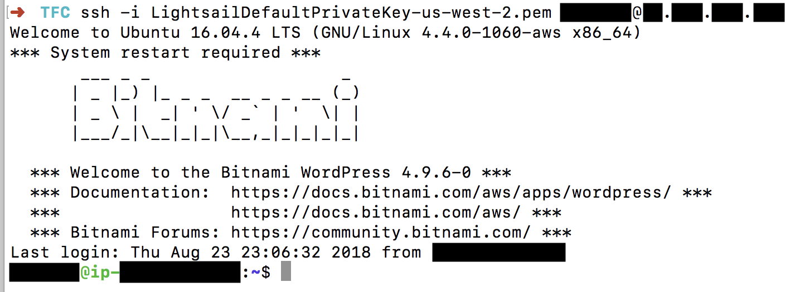
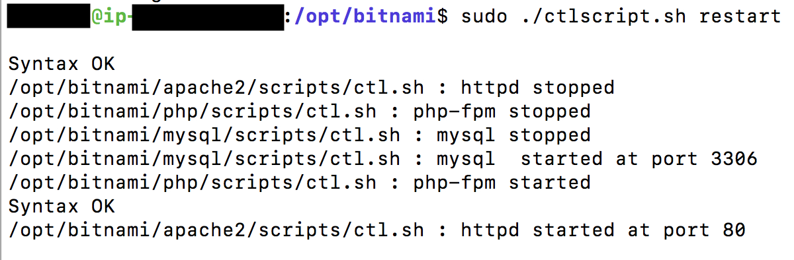

# Tech for Campaigns Theme
(child theme of [Hestia](https://wordpress.org/themes/hestia/))

## Installation
1. Download this repo and create a `.zip` file of the `tfc` folder.
2. TFC will provide you with a staging environment with a default install of WordPress.
    - If you haven't already done so, [use this form to request your staging environment](https://docs.google.com/forms/d/1uESxYKE-uTRhB9SI5Eyb19NMivnV0gLHZb2fnRNuWDs/prefill).
3. Log in to the admin area of the WP install, click on Appearance then click on Themes in the left nav.
4. Click the "Add New" button, then click the "Upload Theme" button.
5. Select the `.zip` file you created, then click the "Install Now" button.
6. Once complete, click the "Activate" link.

This will install the Hestia parent theme and the Tech for Campaigns child theme, with the TFC theme activated.

## Navigating the WordPress Admin

### Plugins
1. In the left nav, under Appearance, click on the tab for Tech For Campaigns Suggested Plugins.
2. Click the checkbox next to Plugin to select all.
3. On the "Bulk Actions" select menu above that, select "Install" and click "Apply".
4. Once complete, select all again and then select "Activate" and click "Apply".
5. There is one other plugin that you will find and activate via the "Customize" tab under "Appearance" in the left nav, called Orbit Fox.

Here's a short description of each suggested plugin:
- **All-in-One WP Migration** is what you will use to export your entire site (files and db) from your staging environment and then import it in to the WP install on your client's hosting enviromment. Learn more at https://wordpress.org/plugins/all-in-one-wp-migration/.
- **Content Views** can be used to add a grid layout on a page. Learn more at https://wordpress.org/plugins/content-views-query-and-display-post-page/.
- **Feed Them Social** can be used to embed feeds from various social media services. We suggest using it to place a list of events from Facebook on the Events page. Learn more at https://wordpress.org/plugins/feed-them-social/.
- **Jetpack** supercharges WordPress and makes it easier to use and includes Google Analytics integration. Jetpack also has social media features you can use within your site. Learn more at https://jetpack.com/pro/.
- **Lightweight Social Icons** can be used in the site footer to encourage people to follow your candidate on social media. Learn more at https://wordpress.org/plugins/lightweight-social-icons/.
- **Pixel Caffeine** configures Facebook Pixel and ties in with your social media strategy. Learn more at https://wordpress.org/plugins/pixel-caffeine/.
- **Orbit Fox** comes with the Hestia theme and is recommended as it gives you additional content areas within the "Customize" section. Learn more at https://themeisle.com/plugins/orbit-fox-companion/.

None of these plugins are required, but all can be useful in getting the most out of your WordPress site.

### Layout
For the most part the theme's layout is fixed, which you will see once you activate the Orbit Fox plugin.

**Homepage**
  - header/nav
  - hero section
    - title
    - subtitle
    - primary CTA
    - secondary CTA
  - two-column widget section
    - We recommend using one for a contact form and the other for the ActBlue donation form.
  - three-column "Features" section
  - footer

**Interior**
  - header/nav
  - heading section
  - content section
  - footer

You can add and remove sections of the homepage via the Appearance > Customize > Frontpage Sections tab. See step 4 under "Customization" below for more info.

### Appearance

#### Customization
You will find the "Customize" tab within "Appearance" in the left navigation.
1. Under the Appearance category in the left navigation, click the "Customize" button. This is where you will spend the bulk of your time getting the look and feel set for your site.
2. Click the "Site Identity" tab to upload a logo for the header. The "Site Title" field is used within the browser tab and search engine results. It is also used in the header if no logo is uploaded. The "Tagline" field is not used and can be left blank. The "Site Icon" field is used to upload a favicon for the browser tab.
3. Click the "Appearance Settings" tab to set some layout options and the font for the site.
4. The "Frontpage Sections" tab is where you will edit the content for your homepage. By default, the CTA Buttons, Big Title Section (hero), CTA Left Widgets, CTA Right Widgets, and Features sections are enabled. We recommend this as the minimum content for the homepage. If you'd like, you may enable the other sections (About, Team, Ribbon, Testimonials, Clients Bar, Subscribe, Blog, or Contact) for additional homepage content.
5. The "Blog Settings" tab is where you can set a post category to be your "featured posts" on the "Latest News" page.
6. Click "Header Options" to customize the sitewide header/navigation. Enable "Very Top Bar" if you have need for utility navigation. The "Navigation" tab gives you a few options for the layout of the header. The "Header Setings" tab allows you to adjust the layout of pages and posts.
7. The "Colors" tab gives you a few options for base styling.
8. The "Menus" tab allows you to edit the header and footer navigation areas.
9. The "Widgets" tab give you options for adding content to the footer (all pages) and sidebar (posts or pages).
10. We recommend leaving the "Homepage Settings" as is. The default settings make "Front Page" the homepage and "Latest News" the posts page.
11. Clicking the "Documentation" button on the "Hestia" tab will take you to more detailed information on all of the information mentioned above and customizing the theme in general.
12. The "Additional CSS" tab is where you can add any custom CSS overrides that you may need to style the page to your needs.

#### Widgets
The "Widgets" area, under "Appearance" is another area where you can configure various pre-set widgets to appear in various areas within the footer or sidebar. It features all of the same ones as can be found in the "Widgets" tab under "Customization".

#### Menus
The "Menus" tab found under "Appearance" gets overridden by the "Menus" tab found under "Customization", so best just to set it there and leave this tab as is.

#### Header / Background
The "Header" and "Background" tabs found within "Appearance" take you to their associated tabs within "Customization".

#### Edit CSS
This tab will take you to the "Additional CSS" section within "Customize".

#### Themes
Your theme is already installed so there is no need to change anything under this tab.

#### Editor
The Editor section is where you can edit the theme's core files. Please don't mess with this unless you are 110% sure you know what you are doing.

### Users
The "Users" tab is where you can give additional people access to create or edit content within the site. You can give a user varying levels of access via five roles that are available. Consult with your Team Lead about appropriate roles for the team's members. The Team Lead should also contact the client about who from their team will need to be added as a user, along with their appropriate roles.
  - **Administrator** - Administrators can perform every task available through the WP dashboard, including changing themes, modifying core files, and adding users/changing existing users' roles. Admins also have complete control over all content. A site may have more than one administrator, but we recommend only giving this role to those users who truly need complete access.

  - **Editor** - The Editor role is for users who need permission to access all of the content, but not themes, plugins, or widgets. Editors can publish, edit, or delete any page or post, including those labeled “private”. They can also moderate comments and manage categories and links. In short, editors can do almost anything with content, but they can’t change any settings.

  - **Author** - Authors can publish, edit, or delete their own posts, but they can’t access anything created by other users. They also can’t create, edit, or delete pages. Authors can upload files into the Media Library and delete anything they have previously uploaded. In addition, Authors can moderate comments on their own posts.

  - **Contributor** - Contributors can write, edit, and delete their own unpublished posts, but their content must be reviewed and published by an Admin or Editor. It’s important to note that Contributors can’t access the Media Library, so if they want to use specific images, videos, or audio files in the Media Library, they have to ask for assistance from an Admin or Editor. The Contributor role is a popular option for guest authors who don’t submit content on a regular basis.

  - **Subscriber** - There is no usecase for this role within TFC sites.

Source: https://thethemefoundry.com/blog/wordpress-user-roles/

### Dashboard
The WordPress dashboard is a set of quick links, notifications, and tools. The most useful piece here becomes available when you activate the Jetpack plugin. Click the "Set Up Jetpack" button and log in to the Jetpack dashboard. On the pricing plans page, click the "Start with Free" button. It will return you to your WP admin area under the Jetpack tab. Click the "Activate recommended features" button. Click the "Okay, got it" button in the Site Stats box. Jetpack is now tracking analytics for your site.

### Jetpack
The Jetpack tab is where you configure some features around composing posts, creating image galleries, performance enhancements (set by default), social media sharing, security, and lots more. Many of the features require signing up for a paid plan. Feel free to contact the client team to see if they are interested in any of these features. They will be responsible for signing up and paying for any plan they choose.

### Posts
Posts is where you will go to create blog content that will show up on the "Latest News" page.

### Media
Media is where you can upload images and video for display throughout Posts and Pages via the "Add Media" button found above the WYSIWYG.

### Pages
Pages is where you will go to enter content for the pages found throughout the site. There are a number of recommended pages created by default when you install the TFC theme. Some are already listed in the header navigation. Feel free to add or delete pages and list them in the navigation as needed.

### Portfolio
The Portfolio section comes with the Jetpack plugin and can be used to create a grid-based presentation of content. It is unlikely that there will be a use case for this feature on campaign sites.

### Comments
The Comments section is where you can moderate comments left on blog posts if you have comments enabled. We recommend that you do not have comments enabled. You can disable commenting under Settings > Discussion.

### Feedback
The Feedback tab comes with Jetpack and is where you will find any responses to any contact forms you create using the "Add Contact Form" button found above the WYSIWYG when creating posts or pages.

### Tools
There will generally be nothing within this section that needs to be addressed or edited.

### Orbit Fox (plugin)
There is no need to change any of the settings under this tab.

### All-in-One WP Migration
This tab is where you will go to export your entire site (files and database) once you are ready to take it from your staging environment to the client's hosting environment. To export, click the "Export To" button and select "File". Once the tool has completed zipping up your site, click the "Download..." button. This will download a `.zip` file to your computer. Go to your client's WP install and install the All-in-One WP Migration plugin. Click on it in the left nav and then click on "Import". Drag your downloaded `.zip` file to the file upload area or select "Import From" and select it from your file system. Once the site has completed uploading a modal will appear instructing you to Settings > Permalinks and clicking "Save Changes" twice. Your entire site should now be imported into your client's production environment.

### Settings
This is where you will control various general settings for things like site name (`<title>`) and description (`<meta name="description" content="...">`), date/time formatting for blog posts, default user roles, commenting, default image sizes, URL structure, and much more. If you are unsure of anything within this section, best to leave it at the default setting.

### Feed Them
The Feed Them tab is where you can create shortcodes to display content from various social media feeds. You will usually need account access for any content you want to display in order to set appropriate settings or generate API keys, so you will need to work with the client team on most of the features here.

### Insights
Insights is a plugin that comes with the Hestia theme and allows you to add features to your blog posts. Learn more at https://wordpress.org/plugins/insights/.

### Pixel Caffeine
Pixel Caffeine is for adding Facebook Pixel tracking to your site for advanced insights via Facebook Advertising. If you client is not doing any Facebook advertising, than this can be left alone.

## Site Maintenance
TFC does not offer post-launch maintenance, except for instances where our team caused errors or bugs. Upon launch, the client team will receive documentation on maintaining their site themselves. If a campaign needs significant additional work done later in the cycle and they are one of our priority states/races, then our campaign relations team will reach out to them about a scoping an upgrade as a unique project.

## Troubleshooting

### Can't send email from staging site (`Could not instantiate mail function`)

Out of the box, PHP provides a basic `mail` function to send email from contact forms in Wordpress. Currently the Bitnami hosting environment doesn't have this feature enabled which will result in any emails you try to send from your WP site to [fail](https://www.thenewsletterplugin.com/sending-tests-error-not-instantiate-mail-function). 

If you find that you cannot send emails from contact forms, your environment may not have this configured yet. Contact form plugins, such as [Pirate Forms](https://themeisle.com/plugins/pirate-forms/), will let you send test emails and give you a little bit of debugging info associated with either successes or failures. 

The specific error you'll be seeing is [`Could not instatiate mail function`](https://github.com/PHPMailer/PHPMailer/wiki/Troubleshooting#could-not-instantiate-mail-function). In order to get this to work, you'll need to do the following:

1. Get the username and `pem` file from TFC to access the staging site via SSH.
2. Save the `pem` file somewhere accessible on your drive  and connect to the staging site as described [in this Bitnami doc (Win/Mac)](https://docs.bitnami.com/aws/faq/starting-bitnami-aws/connect_ssh/)

3. Check to see if `sendmail` is installed by running `whereis sendmail`. If it currently isn't installed, you see an output line that looks like `sendmail: `. If it is installed, you should see the output look more like `sendmail: /usr/sbin/sendmail /usr/lib/sendmail /usr/share/sendmail /usr/share/man/man8/sendmail.8.gz`
4. If `sendmail` isn't installed, run `sudo apt-get install sendmail`. After installation completes, re-run `whereis sendmail` to make sure that you get the correct output. 
5. Now navigate to [`/opt/bitnami/php/etc`](https://docs.bitnami.com/aws/faq/starting-bitnami-aws/understand_directory_structure/). In that dir you should see the `php.ini` file that you'll have to edit. 
6. Run `vim php.ini` and look for the following line: `;sendmail_path = "env -i /usr/sbin/sendmail -t -i"`. Uncomment this line by removing the `;`. Make sure that the path listed here (`/usr/sbin/sendmail`) matches one of the paths outputted from the earlier step where you checked for the `sendmail` location (`whereis sendmail`). If it doesn't, you're going to have to change this line to match (but its usually going to be `/usr/sbin/sendmail`). Save your changes and exit.
7. Now, we need to [restart out services](https://docs.bitnami.com/general/apps/wordpress/#how-to-start-or-stop-the-services) for the change to take effect. Navigate back to `/opt/bitnami` and run `sudo ./ctlscript.sh restart`. Wait for the operation to finish, disconnect from the server and try sending mail again. All should be working now 

Links: ["Could not instantiate mail function" - PHPMailer](https://github.com/PHPMailer/PHPMailer/wiki/Troubleshooting#could-not-instantiate-mail-function), [How to Connect to the Server through SSH? - Bitnami](https://docs.bitnami.com/aws/faq/starting-bitnami-aws/connect_ssh/)[How to Send Email Using Sendmail- Bitnami](https://docs.bitnami.com/aws/components/php/#how-to-send-email-using-sendmail), [Where is the PHP Configuration File? - Bitnami](https://docs.bitnami.com/aws/components/php/#where-is-the-php-configuration-file), [What is the Directory Structure? - Bitnami](https://docs.bitnami.com/aws/faq/starting-bitnami-aws/understand_directory_structure/), [How to Start or Stop the Services? - Bitnami](https://docs.bitnami.com/general/apps/wordpress/#how-to-start-or-stop-the-services)

## Questions?
If you have any questions about working with WordPress or within the TFC theme, feel free to post your questions within the #website-wp-users channel in the TFC Slack channel.
